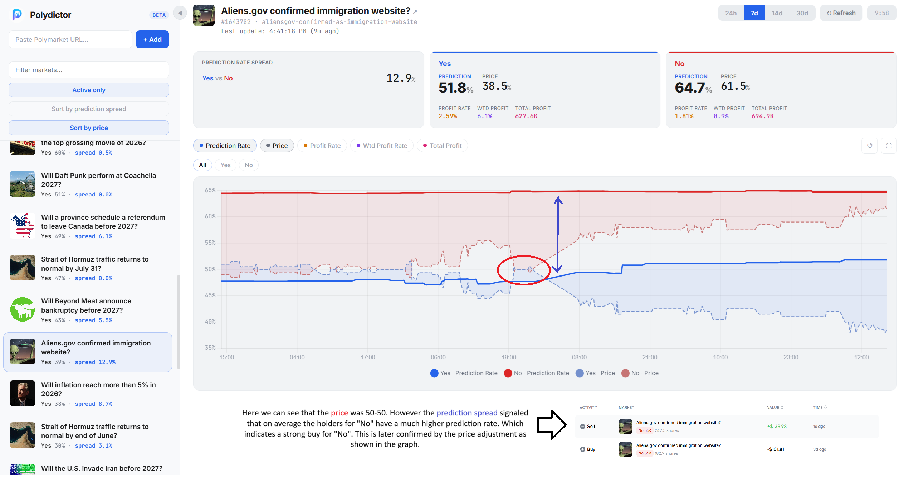

# Polydictor

**Prediction market analytics powered by trader performance.**

Polydictor analyzes [Polymarket](https://polymarket.com) betting markets by evaluating the track record of top token holders. Instead of predicting outcomes directly, it surfaces which outcomes are favored by historically profitable traders - giving you a data-driven edge.

## How It Works

1. **Track a market** - Add any Polymarket event URL
2. **Analyze holders** - Polydictor fetches the top token holders for each outcome and scores them based on their full trading history
3. **Surface signals** - Key metrics are computed per outcome:
   - **Prediction Rate** - What percentage of a holder's past trades were profitable
   - **Profit Rate** - Net profit divided by total investment (ROI)
   - **Weighted Profit Rate** - Profit rate weighted by trade magnitude (big traders count more)
   - **Total Profit** - Aggregate realized PnL across all holders
4. **Track over time** - A continuous loop re-analyzes at a configurable interval, building a historical dataset you can chart and compare

## Demo


- The `prediction rate` for a market outcome represents the average percentage of profitable trades among the top traders for that outcome.
- The spread is the difference between the `prediction rate` of two outcomes. A large spread often indicates that one outcome is more likely to win than the other.

## Quick Start

### Prerequisites

- **[Go 1.25+](https://go.dev/dl/)**

### Run the Web UI

```bash
# 1. Start the analysis loop (runs in background, analyzes tracked markets every 15 min)
go run .\cmd\polydictor analyze-loop -db store.db

# 2. In another terminal, start the web server (serving the API and web UI)
go run .\cmd\polydictor serve -db store.db
```

Open [http://localhost:8081](http://localhost:8081) in your browser. Paste a Polymarket URL to start tracking.

## CLI Commands

### `serve`

Starts the HTTP server and web UI on port **8081**.

```bash
go run .\cmd\polydictor serve [-db store.db]
```

| Flag | Default | Description |
|------|---------|-------------|
| `-db` | `./store.db` | Path to SQLite database |

**API Endpoints:**

| Method | Path | Description |
|--------|------|-------------|
| `GET` | `/tracked` | List all tracked markets |
| `POST` | `/tracked?url=<polymarket_url>` | Add a market to track |
| `GET` | `/get-market-analysis?marketId=<id>&days=<n>` | Fetch historical analysis data |

### `analyze-loop`

Continuously analyzes all tracked markets at a regular interval.

```bash
go run .\cmd\polydictor analyze-loop [-db store.db] [-frequency 15]
```

| Flag | Default | Description |
|------|---------|-------------|
| `-db` | `./store.db` | Path to SQLite database |
| `-frequency` | `15` | Minutes between analyses per market |

### `analyze`

Run a one-off analysis for a single market.

```bash
go run .\cmd\polydictor analyze -slug <market-slug> [-db store.db]
```

### `user`

Display trading performance stats for a specific user/wallet.

```bash
go run .\cmd\polydictor user -id <wallet-address> [-db store.db]
```

## Architecture

```
cmd/polydictor/       CLI entry point & subcommands
pkg/polyapi/          Polymarket API client (rate-limited)
pkg/polyflow/         Analysis engine & SQLite storage
web-ui/dist/          Single-file web dashboard (HTML/CSS/JS)
```

- **polyapi** - Wraps the Polymarket Gamma and Data APIs with per-endpoint rate limiting
- **polyflow** - Core analysis logic: fetches holders, scores users based on closed positions, aggregates metrics per outcome, stores results in SQLite
- **Web UI** - Self-contained HTML file using Chart.js for time-series visualization. No build step required

## Tech Stack

| Component | Technology |
|-----------|-----------|
| Language | Go |
| Database | SQLite |
| Web UI | Vanilla JS + Chart.js |
| Rate Limiting | `golang.org/x/time` |
| License | LGPL-2.1 |

## AI Policy
- The backend is written and maintained by humans, and should remain that way. AI assistance is welcome, but every line of code must be fully understood and explainable by the developer.
- The web UI was largely vibe-coded using AI assistance. The prompts used during development are available in the [`docs`](/docs) directory.
Each prompt used should be added to the [docs](/docs) directory.

## License

This project is licensed under the [GNU Lesser General Public License v2.1](LICENSE).
